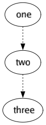
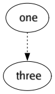
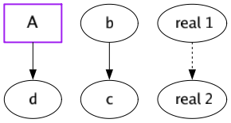
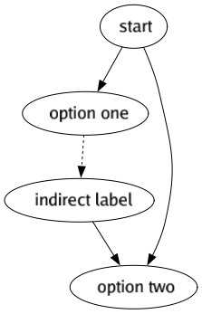

# Ren'Py graph vizualiser

[](https://pkg.go.dev/pkg.amethysts.studio/renpy-graphviz)
[](https://goreportcard.com/report/pkg.amethysts.studio/renpy-graphviz)
[](https://renpy.amethysts.studio)

[](http://gocover.io/pkg.amethysts.studio/renpy-graphviz)

This is a tool written in Go that allows you to **visualise the routes** of your Ren'Py story.


_Routes of the Question, the classic Ren'Py example_

- [Ren'Py graph vizualiser](#renpy-graph-vizualiser)
  - [Examples](#examples)
  - [How to use](#how-to-use)
    - [Online version -try online!](#online-version--try-online)
    - [Software version -install it on your computer](#software-version--install-it-on-your-computer)
    - [Go library](#go-library)
  - [Tags](#tags)
    - [TITLE & GAMEOVER](#title--gameover)
    - [BREAK](#break)
    - [IGNORE](#ignore)
    - [SKIPLINK](#skiplink)
    - [FAKE_LABEL(a) & FAKE_JUMP(a, b)](#fake_labela--fake_jumpa-b)
    - [INGAME_LABEL(a) & INGAME_JUMP(b)](#ingame_labela--ingame_jumpb)
  - [Limitations](#limitations)
  - [LICENSE](#license)

## Examples


_[Doki Doki Litterature Club](https://ddlc.moe/) will no longer have secrets for you!_


_An extract from my personnal VN, [Coalescence](https://play.google.com/store/apps/details?id=com.coal). You can't imagine handling a heavy VN like this one without graphic tools... (the labels aren't blurred on the real image)_

## How to use

### Online version -try online!

You can test this tool in the browser. If you really want to get `.png` files, please download the software version. Note that I will not maintain this website, it is not guaranteed to represent the library 100%.

https://renpy.amethysts.studio

### Software version -install it on your computer

- [**Download**](https://github.com/EwenQuim/renpy-graphviz/releases) latest version
- **Move** the program in your game folder
- **Run it** from the command line `./renpy-graphviz` or by clicking on the icon in your file manager
  - you might have to give yourself the permissions: don't worry my program isn't a virus ! Run `chmod +x renpy-graphviz*` on Unix.
- `renpy-graphviz.png` just appeared, **enjoy** !

_The command line version is more powerful as you can add flags and a path, see the documentation by typing `renpy-graphviz -h`_

### Go library

```
go get pkg.amethysts.studio/renpy-graphviz
```

If you are a Go user and want to integrate this in a Go lib/program, it is totally possible. The `/parser` module is very powerful.

## Tags

Ren'Py scripting isn't strict, so sometimes there are situations the script cannot know what is going on in your story. So I made a tag system to enforce some behaviours. For example

```renpy
label chapter_1: #renpy-graphviz: TITLE
```

Before tags, you must write `renpy-graphviz` in a comment to ensure there are no collision with existing words in your VN. Here are the tags available:

- [TITLE](#TITLE-&-Gameover): style for chapters
- [BREAK](#BREAK): breaks the current flow, for parallel labels for example
- [IGNORE](#IGNORE): ignores the current label. Jumps to this label still exist
- [GAMEOVER](#TITLE-&-Gameover): style for endings
- [SKIPLINK](#SKIPLINK): avoid long arrows by creating a "shortcut" - read the doc below before using
- [FAKE_LABELS](#fake_labela--fake_jumpa-b): simulates labels and jumps
- [INGAME_LABELS](#ingame_labela--ingame_jumpb): same but interacts with real label/jumps

### TITLE & GAMEOVER

Set some styles

<table>
<thead>
  <tr>
    <th>TITLE / GAMEOVER</th>
    <th>script.rpy</th>
  </tr>
</thead>
<tbody>
  <tr>

  <td>
  

  </td>
    <td>

```renpy
label routeone :  # renpy-graphviz: TITlE
    d "Hello World!"
    if condition:
        jump bad_ending

label routeAlternative:
    d "Normal bubble"
    jump good_ending


label bad_ending: # renpy-graphviz: GAMEOVER
    d "Bad ending"
    return
```

  </td>
  </tr>
</tbody>
</table>

### BREAK

Cancels any "guessed link".

<table>
<thead>
  <tr>
    <th>Expected</th>
    <th>with BREAK</th>
    <th>script.rpy</th>
  </tr>
</thead>
<tbody>
  <tr>
    <td>


  </td>
    <td>
  

  </td>
    <td>

```renpy
label one:
  "blah blah"

label two:
"bla bla"

# renpy-graphviz: BREAK

label three:
"the end"
```

  </td>
  </tr>
</tbody>
</table>

### IGNORE

Ignore the current line. If this is a jump to a label that isn't ignored, the label will still appear on the graph but not the arrow that should go towards it.

<table>
<thead>
  <tr>
    <th>Expected</th>
    <th>IGNORE</th>
    <th>script.rpy</th>
  </tr>
</thead>
<tbody>
  <tr>
    <td>



  </td>
    <td>
  

  </td>
    <td>

```renpy
label one:
label two: # renpy-graphviz: IGNORE
label three:
```

  </td>
  </tr>
</tbody>
</table>

### SKIPLINK

Avoids long arrows by creating another label with the same name. Beware, the label can't have any children and is marked by an asterix to show it is a copy.

<table>
<thead>
  <tr>
    <th>Expected</th>
    <th>SKIPLINK</th>
    <th>script.rpy</th>
  </tr>
</thead>
<tbody>
  <tr>
    <td>


  </td>
    <td>
  

  </td>
    <td>

```renpy
label one:
    if condition:
        jump six # renpy-graphviz: SKIPLINK
    else:
        pass

label two:
label three:
label four:
label five:
label six:
```

  </td>
  </tr>
</tbody>
</table>

### FAKE_LABEL(a) & FAKE_JUMP(a, b)

Creates a node or an arrow in the graph without having to create `label thing` in your Ren'Py script. It is disconnected from the "normal flow", `label` and `jump` in your script (see example below).

<table>
<thead>
  <tr>
    <th>FAKES</th>
    <th>script.rpy</th>
  </tr>
</thead>
<tbody>
  <tr>
    <td>
  

  </td>
    <td>

```renpy
# You can mix different tags on the same line
# renpy-graphviz: FAKE_LABEL(a) TITLE
# If b/c does not exists, it creates it
# renpy-graphviz: FAKE_JUMP(b, c)

label real_1:
# There will be no 'indirect link' from `real_1` to `d`
# renpy-graphviz: FAKE_LABEL(d)

# Implicit jump from `real_one` to `real_two`
# (normal behaviour as `d` is ignored by the normal flow)
label real_2:

# No jump from `real_two` to `a` or `d`
# renpy-graphviz: FAKE_JUMP(a, d)

```

  </td>
  </tr>
</tbody>
</table>

### INGAME_LABEL(a) & INGAME_JUMP(b)

Same that above but interacts with the "normal flow", your `label`, `call` and `jump` from your Ren'Py script.

<table>
<thead>
  <tr>
    <th>INGAMES</th>
    <th>script.rpy</th>
  </tr>
</thead>
<tbody>
  <tr>
    <td>
  

  </td>
    <td>

```renpy
# renpy-graphviz: INGAME_LABEL(start)
# renpy-graphviz: INGAME_JUMP(option_one)

# Creates a link from `start` to `option_two` even
# if there was a jump before -like normal jumps
# renpy-graphviz: INGAME_JUMP(option_two)

label option_one:
    "dialogue"

# should follow the previous label (implicit jump)
# renpy-graphviz: INGAME_LABEL(indirect_label)

# jumps from `indirect_label` to `option_two`
    jump option_two
```

  </td>
  </tr>
</tbody>
</table>

## Limitations

This require your VN to be structured in a certain way, so it's possible that it isn't perfect for you. Feel free to raise an issue [here](https://github.com/EwenQuim/renpy-graphviz/issues), or to change your VN structure, by adding tags manually.

It does not handle screens for the moments, but **your contribution to the project** are appreciated!

## LICENSE

This program is free and under the [AGPLv3 license](https://www.gnu.org/licenses/agpl-3.0.en.html).

Beware, if you use this program, you must **credit it somewhere on your game**.

> Used Renpy Graph Vizualiser from EwenQuim

Enjoy! ❤️
