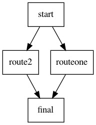

# Ren'Py graph vizualiser

This is a program written in Go that allows you to visualise you VN.

This require your VN to be structured in a certain way, so it's possible that it isn't perfect for you. Feel free to raise an issue [here](https://github.com/EwenQuim/renpy-graphviz/issues)

## LICENSE

This program is free and under the [AGPLv3 license](https://www.gnu.org/licenses/agpl-3.0.en.html).

Beware, if you use this program, you must **credit it somewhere on your game**.

> Used Renpy Graph Vizualiser from EwenQuim
