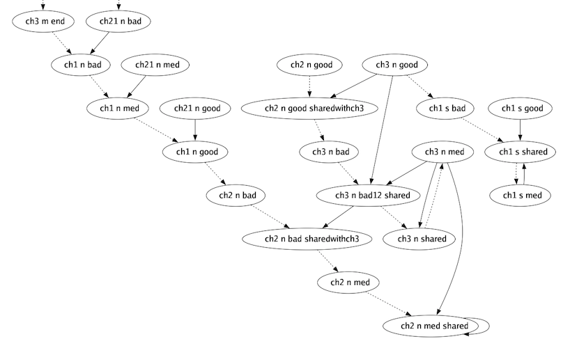

# Ren'Py graph vizualiser

[](https://pkg.go.dev/pkg.amethysts.studio/renpy-graphviz)
[](https://goreportcard.com/report/pkg.amethysts.studio/renpy-graphviz)


This is a tool written in Go that allows you to **visualise the routes** of your story.


_Routes of the Question, the classic Ren'Py example_


_[Doki Doki Litterature Club](https://ddlc.moe/) will no longer have secrets for you!_


_An extract from my personnal VN, [Coalescence](https://play.google.com/store/apps/details?id=com.coal). You can't imagine handling a heavy VN like this one without graphic tools... (the labels aren't blurred on the real image)_

## How to use

- [**Download**](https://github.com/EwenQuim/renpy-graphviz/releases) latest version
- **Move** the program in your game folder
- **Run it** from the command line
  - you might have to give yourself the permissions: don't worry my program isn't a virus ! Run `chmod +x renpy-graphviz*`
- `renpy-graphviz.png` just appeared, **enjoy** !

## Advanced usage

### Tags

I made a tag system to enforce some behaviours. For example

```python
label chapter_1: #renpy-graphviz: TITLE
```

Before tags, you must write `renpy-graphviz` to ensure there are no collision with existing words in your VN.

Here are the tags available

- `TITLE`: style for chapters
- `BREAK`: breaks the current flow, for parallel labels for example
- `IGNORE`: ignores the current label. Jumps to this label still exist
- `GAMEOVER`: style for endings
- `SKIPLINK`: avoid long arrows by creating a "shortcut" - read the doc below before using

Case, spaces and separators are handled very loosely, don't worry about it.

#### TITLE & GAMEOVER

Set some styles


#### BREAK

Cancels any "guessed link".

```renpy
label one:
  "blah blah"

label two:
    "bla bla"

# renpy-graphviz: BREAK
label three:
    "the end"

```

|            without tag             |             with tag              |
| :--------------------------------: | :-------------------------------: |
|  |  |

#### IGNORE

Ignore the current line. If this is a jump to a label that isn't ignored, the label will still appear on the graph but not the arrow that should go towards it.

#### SKIPLINK

Avoids long arrows by creating another label with the same name. Beware, the label can't have any children and is marked by an asterix to show it is a copy.

```renpy
label one:
    if condition:
        jump six # renpy-graphviz: SKIPLINK
    else:
        pass

label two:
label three:
label four:
label five:
label six:
```

|              without tag              |               with tag               |
| :-----------------------------------: | :----------------------------------: |
|  |  |

## Limitations

This require your VN to be structured in a certain way, so it's possible that it isn't perfect for you. Feel free to raise an issue [here](https://github.com/EwenQuim/renpy-graphviz/issues), or to change your VN structure.

The program works only for scripts that do not stack call statement, i.e. the program expects a `break` statement before any other `label`/`call` if you used call to get there.

Works:

```renpy
label start:
  eileen "hello"
  call second
  eileen "I'm back"

# renpy-graphviz: BREAK <- recommended here but not mandatory, see Tags section
label second:
  eileen "inside a CALL statement"
  break <- works !!!
```

Does NOT work:

```renpy
label start:
  eileen "hello"
  call second
  eileen "I'm back"

# renpy-graphviz: BREAK <- recommended here but not mandatory, see Tags section
label second:
  eileen "inside a CALL statement"
  call / jump third_label <- Isn't taken into account !!!!

label third_label
```

## LICENSE

This program is free and under the [AGPLv3 license](https://www.gnu.org/licenses/agpl-3.0.en.html).

Beware, if you use this program, you must **credit it somewhere on your game**.

> Used Renpy Graph Vizualiser from EwenQuim

Enjoy!
