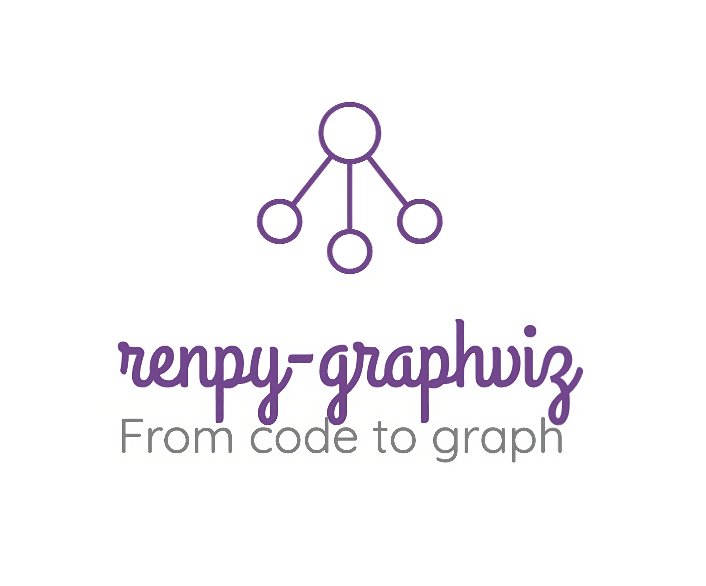
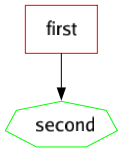

<p align="center">
  
</p>

# Ren'Py graph visualizer - branches flowchart generator

[](https://pkg.go.dev/pkg.amethysts.studio/renpy-graphviz)
[](https://goreportcard.com/report/pkg.amethysts.studio/renpy-graphviz)


This is a tool written in Go that allows you to **visualize the routes** of your Ren'Py story


_Routes of the Question, the classic Ren'Py example_

## Table of Contents

- [Ren'Py graph visualizer - branches flowchart generator](#renpy-graph-visualizer---branches-flowchart-generator)
  - [Table of Contents](#table-of-contents)
  - [Examples](#examples)
  - [🔎 HOW TO USE?](#-how-to-use)
    - [Online version - try online](#online-version---try-online)
    - [Software version -install it on your computer](#software-version--install-it-on-your-computer)
    - [Go library](#go-library)
  - [🏷 Tags](#-tags)
    - [BREAK](#break)
    - [IGNORE](#ignore)
    - [SKIPLINK](#skiplink)
    - [FAKE\_LABEL(a) \& FAKE\_JUMP(a, b)](#fake_labela--fake_jumpa-b)
    - [INGAME\_LABEL(i, a) \& INGAME\_JUMP(i, b)](#ingame_labeli-a--ingame_jumpi-b)
    - [TITLE \& GAMEOVER](#title--gameover)
    - [SHAPE \& COLOR](#shape--color)
  - [Limitations](#limitations)
  - [CONTRIBUTING](#contributing)
  - [LICENSE](#license)

## Examples


_[Doki Doki Litterature Club](https://ddlc.moe/) will no longer have secrets for you!_


_An extract from my personal VN, [Coalescence](https://play.google.com/store/apps/details?id=com.coal). You can't imagine handling a heavy VN like this one without graphic tools... The labels are blurred due to the preview image_

## 🔎 HOW TO USE?

### Online version - try online

You can [test this tool in the browser](https://ewenquim.github.io/renpy-graphviz). If you want to get `.png` files, please download the software version. Note that this website will not be maintained and it is not guaranteed to represent the library fully.

<https://ewenquim.github.io/renpy-graphviz>

### Software version -install it on your computer

The command line version is more powerful as you can add flags and a path, see the documentation by typing `renpy-graphviz -h`.

- [**Download**](https://github.com/EwenQuim/renpy-graphviz/releases) the latest version
- **Move** the program to your game folder
- **Run it** from the command line `./renpy-graphviz` or by clicking on the icon in your file manager
  - You might need to provide permissions, this program is not a virus. On Unix, run `chmod +x renpy-graphviz*`.
- `renpy-graphviz.png` should appear, **enjoy**!

Use the boolean flags only in `-flag=value` format, not in `-flag value ` format, e.g. use `./renpy-graphviz -open=false`.

### Go library

```cmd
go install pkg.amethysts.studio/renpy-graphviz@latest
```

If you are a Go user and want to integrate this in a Go lib/program, it is possible. The `/parser` module is very powerful.

## 🏷 Tags

Since Ren'Py scripting isn't strict, therefore the script can't know what is going on in the `.rpy` file in some cases. So, this program uses a tag system to enforce some behaviors. For example;

```renpy
label chapter_1: #renpy-graphviz: TITLE
```

Before tags, you must write `renpy-graphviz` in a comment to ensure there are no collisions with existing words in your VN. Here are the tags available:

- BEHAVIOUR TAGS
  - [BREAK](#break) breaks the current flow for linear labels, creating a new parallel
  - [IGNORE](#ignore) ignores the current label. Jumps to this label will be drawn
  - [SKIPLINK](#skiplink) avoids long arrows by creating shortcuts marked with an asterisk. These shortcuts can't have child nodes
  - [FAKE_LABELS](#fake_labela--fake_jumpa-b) simulates labels and jumps, creating a new parallel
  - [INGAME_LABELS](#ingame_labeli-a--ingame_jumpi-b) interacts with real labels and jumps, similar to fake labels
- STYLE TAGS
  - [TITLE](#title--gameover) is a style for chapters
  - [GAMEOVER](#title--gameover) is a style for endings
  - [SHAPE](#shape--color) sets a shape
  - [COLOR](#shape--color) sets a color

### BREAK

Cancels any "guessed link".

<table><thead><tr><th>Expected</th><th>with BREAK</th><th>script.rpy</th></tr></thead><tbody><tr><td>

</td><td>
</td><td>

```renpy
label one:
  "blah blah"

label two:
"bla bla"

# renpy-graphviz: BREAK

label three:
"the end"
```

</td></tr></tbody></table>

### IGNORE

Ignores the current line. If this is a jump to a label that isn't ignored, the label will still appear on the graph but not the arrow that should go towards it. Similarly, if this is a jump from a label that isn't ignored but the jump destination is, the arrow will not appear on the graph.

<table><thead><tr><th>Expected</th><th>IGNORE</th><th>script.rpy</th></tr></thead><tbody><tr><td>

</td><td>
</td><td>

```renpy
label one:
label two: # renpy-graphviz: IGNORE
label three:
```

</td></tr></tbody></table>

### SKIPLINK

Avoids long arrows by creating another label with the same name. Beware, the label can't have any children and is marked by an asterisk to show it is a copy. Jumps will not be directed to this label if there is an original label displayed, if not, the jump is ignored.

<table><thead><tr><th>Expected</th><th>SKIPLINK</th><th>script.rpy</th></tr></thead><tbody><tr><td>

</td><td>
</td><td>

```renpy
label one:
    if condition:
        jump six # renpy-graphviz: SKIPLINK
    else:
        pass

label two:
label three:
label four:
label five:
label six:
```

</td></tr></tbody></table>

### FAKE_LABEL(a) & FAKE_JUMP(a, b)

Creates a node or an arrow in the graph without having to create a `label` in your Ren'Py script. It is disconnected from the normal flow, `label` and `jump` in your script.

<table><thead><tr><th>FAKES</th><th>script.rpy</th></tr></thead><tbody><tr><td>

</td><td>

```renpy
# You can mix different tags on the same line
# renpy-graphviz: FAKE_LABEL(a) TITLE
# If b/c does not exists, it creates it
# renpy-graphviz: FAKE_JUMP(b, c)

label real_1:
# There will be no 'indirect link' from `real_1` to `d`
# renpy-graphviz: FAKE_LABEL(d)

# Implicit jump from `real_one` to `real_two`
# (normal behaviour as `d` is ignored by the normal flow)
label real_2:

# No jump from `real_two` to `a` or `d`
# renpy-graphviz: FAKE_JUMP(a, d)

```

</td></tr></tbody></table>

### INGAME_LABEL(i, a) & INGAME_JUMP(i, b)

Same as above but interacts with `label`, `call` and `jump` in your normal flow in the Ren'Py script.
You need to specify an indentation level.

```renpy
# renpy-graphviz: INGAME_JUMP(8, destination)
```

is the equivalent of:

```renpy
        jump destination
```

<table><thead><tr><th>INGAMES</th><th>script.rpy</th></tr></thead><tbody><tr><td>

</td><td>

```renpy
# renpy-graphviz: INGAME_LABEL(0, start)
# renpy-graphviz: INGAME_JUMP(4, option_one)

# Creates a link from `start` to `option_two` even
# if there was a jump before -like normal jumps
# renpy-graphviz: INGAME_JUMP(4, option_two)

label option_one:
    "dialogue"

# should follow the previous label (implicit jump)
# renpy-graphviz: INGAME_LABEL(0, indirect_label)

# jumps from `indirect_label` to `option_two`
    jump option_two
```

</td></tr></tbody></table>

### TITLE & GAMEOVER

Sets styles.

<table><thead><tr><th>TITLE / GAMEOVER</th><th>script.rpy</th></tr></thead><tbody><tr><td>

</td><td>

```renpy
label routeone :  # renpy-graphviz: TITlE
    d "Hello World!"
    if condition:
        jump bad_ending

label routeAlternative:
    d "Normal bubble"
    jump good_ending


label bad_ending: # renpy-graphviz: GAMEOVER
    d "Bad ending"
    return
```

</td></tr></tbody></table>

### SHAPE & COLOR

You can set yourself a custom color or shape for a label.

<table><thead><tr><th>SHAPE and/or COLOR</th><th>script.rpy</th></tr></thead><tbody><tr><td>

</td><td>

```renpy
label first: # renpy-graphviz: SHAPE(rect) COLOR(red)
    jump second # renpy-graphviz: SHAPE(septagon) COLOR(#ffdd67)
```

</td></tr></tbody></table>

Some examples of shapes and colors can be found here.

| Shapes    | Colors |
| --------- | ------ |
| Rectangle | Red    |
| Septagon  | Blue   |
| Egg       | Purple |
| Diamond   | White  |

`graph.go` file also supports line styling, font size and line thickness. Default values can also be changed inside the `graph.go` file.

## Limitations

This requires your VN to be structured in a certain way, so this may not be perfect for you. Feel free to raise an issue [here](https://github.com/EwenQuim/renpy-graphviz/issues), or to change your VN structure, by adding tags manually.

**Your contribution to the project** is appreciated!

## CONTRIBUTING

See the [CONTRIBUTING.md](./CONTRIBUTING.md) file

## LICENSE

This program is free and under the [AGPLv3 license](https://www.gnu.org/licenses/agpl-3.0.en.html).

Beware, if you use this program, you must **credit it somewhere on your game**.

> Used Renpy Graph Vizualiser from EwenQuim

Enjoy! ❤️
